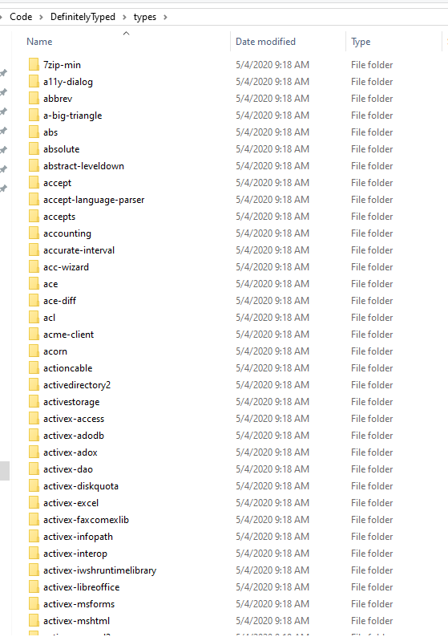
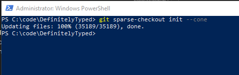
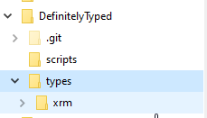
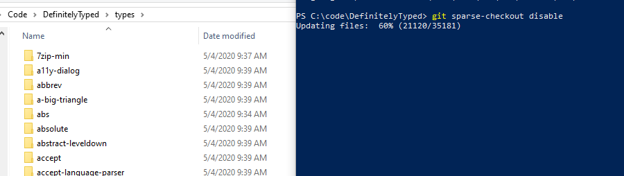

If you would like to make updates to the Xrm types or any others in the DefinitelyTyped project on github you can find that cloning all the types can be a real pain.  This is because a typical git clone will bring down everything and having over 6 thousand directories in this project can make thigns a bit slow.  Startign with Git version 2.25.0 a new feature was introduces called sparse-checkout.  This feature can be used to limit what is brough down in your git requests much like a .gitignore file, in fact it even uses the same filtering formats.  The benefit of using this new feature is that you don't need to update the .gitignore file which would be tracked in the changes. Instead these options are stored in your repo settings locally and will not show up as changes to your files.

Let's take a look!

Here is my types directory in DefinitelyTyped clone.  You can see that there are a lot of types, over 6K in fact.  Righ now every time you do a pull it can take a little while because of all the other stuff here, let's "sparse" it down to what we need.

First make sure you have [Git 2.25.0](https://git-scm.com/downloads) or greater.

Next make sure you don't have any oustanding changes or commits on your repo.  Then open a command prompt to your repo directory and enter the following command.

``
git sparse-checkout init --cone 
``

The initial sparsing will limit the repo down to only the root level folders.  Now we need to get back what is needed in order to work.  In this case I'm goign to be bringing back two folders.

* Scripts - since we need this one to run npm commands and for tslint to work.
* types/Xrm - since those are the types I want to work on.

To bring these folders badk we can run the following command.

``
git sparse-checkout set /scripts /types/xrm
``

After this runs you directories will now look like this.  You will notice that only the Xrm types are there now, all the other type directories are gone.

If you want to add additional folder you can do so by running the add command.

``
git sparse-checkout add /types/7zip-min
``

If you want to go back to your original repo and disable the sparsing entirely you can just run the disable command and everything will be back to normal.

``
git sparse-checkout disable
``

Sparse checkout can be very help to limit what files you are potentially modifying on large project and can definately reduce the confusion of having so many directories.  Happy coding!