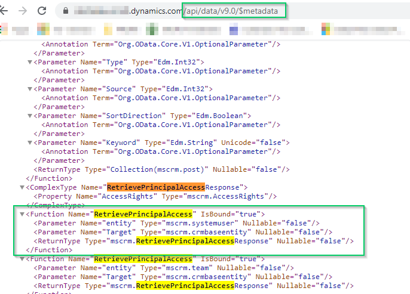

I am current building PCF component that required me to determine if the user has specific rights to an entity before attempting to modify it.  In order to do this I needed to figure out how to do an execute request for a Function bound to an Entity.  The hardest part in doing all is really figuring out the parameters and parameterTypes you need to send with the request.


  

This Microsoft article on how to [Use Web API functions](https://docs.microsoft.com/en-us/powerapps/developer/common-data-service/webapi/use-web-api-functions).  The real takeaway from this article was pulling up the [CDS metadata document](https://docs.microsoft.com/en-us/powerapps/developer/common-data-service/webapi/web-api-types-operations#bkmk_csdl) for the system to determine the properties.  Additionally the documentation for the [Xrm.WebApi.online.execute](https://docs.microsoft.com/en-us/powerapps/developer/model-driven-apps/clientapi/reference/xrm-webapi/online/execute) function was also useful.


  

``

https://<yourorg>.crm.dynamics.com/api/data/v9.0/$metadata 

``


  

This document contains the function name and their input properties.


  




  

After finding the function in the document i was able to determine that I needed the following properties: entity, Target.  This also gave me their Types which i could use i the parameterTypes section of the request.  That being said it was still someone of a pain to figure out how to create the entity and Target correctly.  In the end I believe entity is an actual Entity record which is why you construct it with a entityType and an Id and the Target is an EntityReference which is why it's constructed with an @odata.type and the actual id field name.


  

My final code is below.  Hope this help save someone some time.

```
    

  

```

static async retrievePrincipalAccess(entityId: string, entityTypeName: string, pcfContext: ComponentFramework.Context<IInputs>): Promise<string[]>{        
        

let userId = pcfContext.userSettings.userId.replace(/({|})/g, "");

        

  

const PrincipalAccessRequest: any = function (entityTypeName: string, entityId: string) {
            

this.entity = {                
                "entityType": 'systemuser',                
                "id": userId
            }
            this.Target = {                
                

"entityType": 'systemuser',

"id": userId

}

this.Target = {

"@odata.type": `Microsoft.Dynamics.CRM.${entityTypeName}`,
                

`${entityTypeName}id`: entityId
            };                        
        };

        

};

};

  

PrincipalAccessRequest.prototype.getMetadata = function (){
            return {
                

return {

//set to entity since it's a bound function
                

boundParameter: 'entity',
                

//get parameter types from CDS Metadata document
                parameterTypes: {
                    "entity": {
                        "typeName": "mscrm.systemuser",  
                        "structuralProperty": 5  
                    },
                    "Target": {  
                        "typeName": "mscrm.crmbaseentity",  
                        "structuralProperty": 5  
                    }
                },
                //operation type is 1 because it's a function
                operationType: 1,                
                operationName: "RetrievePrincipalAccess"
            }; 
        }
        
        

parameterTypes: {

"entity": {

"typeName": "mscrm.systemuser",

"structuralProperty": 5

},

"Target": {

"typeName": "mscrm.crmbaseentity",

"structuralProperty": 5

}

},

//operation type is 1 because it's a function

operationType: 1,

operationName: "RetrievePrincipalAccess"

};

}

let request = new PrincipalAccessRequest(entityTypeName, entityId);                       
        

let response = await this.executePrincipalAccessRequest(request);
        

//if response is null then there was an issue obtaining the access rights.
        

if (!response) return [];
        

let accessRights = await this.returnAccessRightsFromResponse(response);
        

return accessRights;        
    }

    

}

  

static async executePrincipalAccessRequest(request: any, pcfContext: ComponentFramework.Context<IInputs>){
        try {
            

try {

//The PCF context current has the execute on it but it's not included in the types
            ///@ts-ignore                       
            

///@ts-ignore

return await pcfContext.WebAPI.execute(request).then(
                

async (response: any) => {                    
                    if (response.ok)
                    { 
                        return response;
                    }
                    else{
                        return '';   
                    }
                },
                (error: any) => {
                    return null;
                }
            );
        }
        catch (error) {
            return null;
        }
    }


if (response.ok)

{

return response;

}

else{

return '';

}

},

(error: any) => {

return null;

}

);

}

catch (error) {

return null;

}

}

    

static async returnAccessRightsFromResponse(response: any): Promise<string[]>{
        

let accessRights: string[] = [];

        

  

await response.json().then(
            

(responseObj: any) => { 
                

if (responseObj.hasOwnProperty('AccessRights'))
                {
                    

{

accessRights = responseObj.AccessRights.split(', ');
                }                
            }
        )
        

}

}

)

return accessRights;
    }

}

```
<!--stackedit_data:
eyJoaXN0b3J5IjpbLTEwODE3NDI0NzJdfQ==
-->