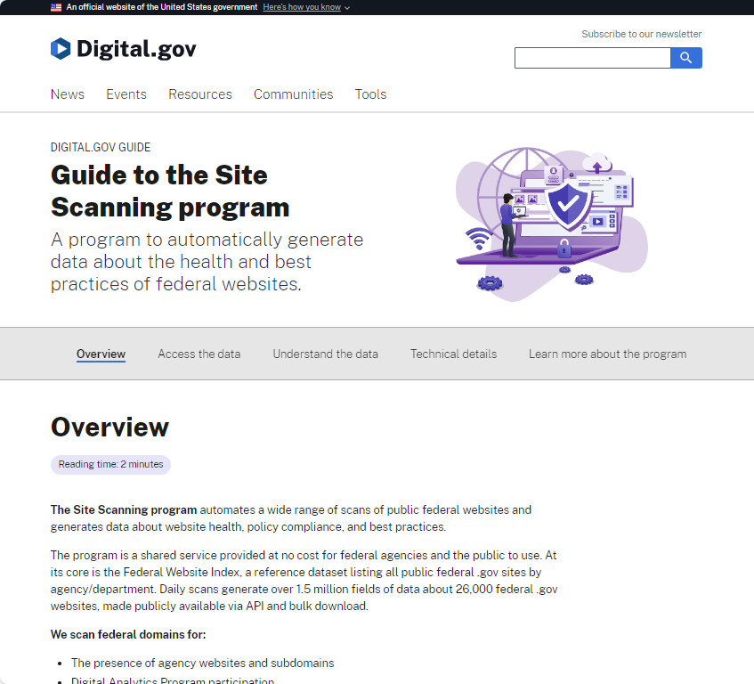

# Government API Development Playbook: Designing for Power Platform and Building Custom Connectors


**Table of Contents**

<!-- TOC depthfrom:2 depthto:3 -->

- [Introduction](#introduction)
    - [For Government API Developers](#for-government-api-developers)
    - [For Custom Connector Developers](#for-custom-connector-developers)
- [Part I: Guidelines for Government API Developers](#part-i-guidelines-for-government-api-developers)
    - [Best Practices for Government API Developers](#best-practices-for-government-api-developers)
    - [The Importance of Unique Paths in API Design](#the-importance-of-unique-paths-in-api-design)
    - [Publishing API Definitions](#publishing-api-definitions)
    - [Guidance for Implementing Effective Pagination in APIs for Power Platform](#guidance-for-implementing-effective-pagination-in-apis-for-power-platform)
- [Part II: Empowering Connector Development](#part-ii-empowering-connector-development)
    - [Selecting and Connecting to APIs](#selecting-and-connecting-to-apis)
    - [Endpoint Considerations for Government Clouds](#endpoint-considerations-for-government-clouds)
    - [Adhering to Published Coding Standards for Custom Connectors](#adhering-to-published-coding-standards-for-custom-connectors)
    - [Leveraging OpenAPI and Postman for Custom Connector Creation](#leveraging-openapi-and-postman-for-custom-connector-creation)
    - [Utilizing OpenAPI for Connector Generation](#utilizing-openapi-for-connector-generation)
    - [Speeding Up Development with Postman](#speeding-up-development-with-postman)
    - [Combining OpenAPI and Postman for Comprehensive Connector Development](#combining-openapi-and-postman-for-comprehensive-connector-development)
    - [OpenAPI Extensions for Custom Connectors](#openapi-extensions-for-custom-connectors)
    - [Utilizing AI for Enhanced Connector Development](#utilizing-ai-for-enhanced-connector-development)
    - [Connector Policies: Bridging the Gap in API Standards](#connector-policies-bridging-the-gap-in-api-standards)
    - [Writing Custom Code for Connectors: Extending Functionality Beyond Policies](#writing-custom-code-for-connectors-extending-functionality-beyond-policies)
    - [Publishing Through the Independent Publisher Connectors Program and Verified Publishing](#publishing-through-the-independent-publisher-connectors-program-and-verified-publishing)
- [Part III: Case Study and Practical Implementation](#part-iii-case-study-and-practical-implementation)
    - [My Process for Creating a Custom Connector: The GSA Site Scanning API Case Study](#my-process-for-creating-a-custom-connector-the-gsa-site-scanning-api-case-study)
    - [Creating the Connector Step-By-Step](#creating-the-connector-step-by-step)
    - [Viewing the Final Output](#viewing-the-final-output)
- [Conclusion: Bridging Government APIs and the Power Platform](#conclusion-bridging-government-apis-and-the-power-platform)
    - [Impact on Digital Government Services](#impact-on-digital-government-services)

<!-- /TOC -->

## Introduction

In the rapidly evolving landscape of digital government services, the Microsoft Power Platform stands out as a transformative tool for streamlining operations, enhancing data integration, and fostering automation across workflows. At the heart of this ecosystem are custom connectors, which serve as essential links between the Power Platform and a myriad of data sources, notably including a wealth of US government APIs.

This guide is designed with a dual purpose: not only to assist developers in crafting custom connectors that unlock the rich potential of existing government APIs but also to serve as a valuable resource for government entities embarking on the development or refinement of APIs. The aim is to ensure these APIs are inherently aligned with Power Platform connector standards, thereby simplifying the connector creation process and enabling full utilization of Power Platform capabilities, such as built-in paging and seamless data access.

### For Government API Developers

This guide begins by addressing the creators of government APIs, emphasizing the importance of designing with Power Platform integration in mind. By adhering to connector standards and implementing features like OpenAPI specifications and efficient pagination from the outset, government APIs can greatly enhance their compatibility and functionality within the Power Platform ecosystem. This section aims to equip API developers with the knowledge to build or update their APIs in a way that facilitates ease of use, maximizes accessibility, and leverages the full spectrum of Power Platform features.

Focusing on these areas aims to foster a more interconnected, efficient, and user-friendly landscape for digital government services, empowering developers and government entities alike to contribute to a robust and dynamic digital ecosystem.

### For Custom Connector Developers

Following the guidance for government API developers, this section offers a comprehensive roadmap for navigating the intricacies of connecting to US government APIs, leveraging these connections to enhance the Power Platform's automation and data processing capabilities. Dedicated to developers seeking to bridge the Power Platform with government data sources, it provides best practices, tools, and insights to streamline development and ensure secure, effective integration. This approach ensures that custom connectors are not only efficiently developed but also fully utilize the capabilities and data provided by government APIs.

## Part I: Guidelines for Government API Developers

### Best Practices for Government API Developers

Developing APIs with a focus on ease of integration into custom connectors is crucial for maximizing the utility of government data. A well-designed API not only facilitates seamless connectivity but also enhances user experiences by providing clear, efficient access to data.

#### Why Building on Standards Like OpenAPI Is Important

The Power Platform connectors, along with Logic Apps, utilize the OpenAPI standard, emphasizing its significance in creating adaptable and interoperable APIs. OpenAPI offers a language-agnostic way to describe RESTful APIs, which can be used to generate code-stubs and documentation. This specification plays a pivotal role in decoupling the public interface of an API from its implementation details, allowing business and design teams to outline the features they need independently of the engineering team's work.

- **Design-First Approach**: OpenAPI allows for the API to be defined with types and examples for every endpoint before implementation. This design-first approach facilitates refining API design by iterating over the specification document, ensuring the API meets both business requirements and technical constraints.

- **Code Generators and Tooling**: The OpenAPI ecosystem provides tools to create mock APIs, generate documentation, tests, and server stubs. This accelerates the API development process, making it easier for front-end developers to work with a practical interface even before the back-end is fully implemented.

- **Huge Userbase and Stable Implementation**: Backed by many large organizations, OpenAPI represents condensed knowledge from thousands of APIs developed over the years. Its stable implementation and wide adoption provide a reliable foundation for building modern APIs.

- **Facilitating Better Engineering and Usage**: Standards provide a common framework of communication and development, helping to pick the right tools based on specific needs. The OpenAPI Specification, in particular, aids in building consumer-centric APIs by ensuring a good developer experience through a definition-driven approach.

Incorporating OpenAPI standards into the development of government APIs is instrumental in achieving interoperability, ensuring security, and enhancing the overall quality of digital services. It lays a solid foundation for APIs that not only serve the intended purpose efficiently but are also easier to use, document, and integrate with platforms like the Power Platform.

By adopting a standardized approach to API development, government developers can ensure their APIs are robust, scalable, and ready to meet the evolving needs of both internal and external consumers. This approach not only streamlines the development process but also paves the way for a more connected and efficient digital government infrastructure.

### The Importance of Unique Paths in API Design

- **Design Considerations**: Ensure that each operation within your API has a unique path. This clarity in design helps custom connector developers to create precise actions, allowing end-users to efficiently target the information they need. The OpenAPI specification emphasizes that a path can only be used once per method, although you can have multiple operations (HTTP methods) for each path. This specification underlines the necessity of segregating your API into distinct actions/paths during development. Utilizing a single path to retrieve different data types can lead to confusion and complicate the user experience.

- **OpenAPI Specification Guidance**: According to the [Swagger definition website for OpenAPI 2.0](https://swagger.io/docs/specification/2-0/paths-and-operations/), paths serve as the unique identifiers for operations within an API, and employing unique paths ensures that the API's structure remains clear and logical. Adhering to this specification aids developers in avoiding functional overlaps within the API, thereby simplifying navigation and usage of the API through custom connectors.

### Publishing API Definitions

Make your OpenAPI definitions publicly available, as exemplified by various GSA APIs, to simplify the development of custom connectors. Providing these definitions enables developers to quickly understand and integrate your API’s capabilities into the Power Platform, fostering a collaborative ecosystem.

- Example: The [Site Scanning API by GSA](https://open.gsa.gov/api/site-scanning-api/#openapi-specification-file) offers its OpenAPI specification file for download, facilitating an excellent starting point for connector development.

### Guidance for Implementing Effective Pagination in APIs for Power Platform

For APIs to be fully compatible with Power Platform and Logic Apps, supporting built-in paging functionality is crucial. This involves designing your API to return paginated responses that adhere to a specific structure, enabling Power Platform to correctly navigate through data sets across multiple pages. Below are the key requirements and examples for structuring your API responses for effective pagination.

#### Requirements for Returning Paginated Responses (JSON)

1. **nextLink**: Include a `nextLink` property in the JSON response body, which contains the URI for accessing the next page of results. This property should be present only when there are more pages to fetch. If there are no additional pages, omit the `nextLink` property.

2. **value**: The response must have a `value` array that houses the results for the current page. The objects within this array represent the actual data items retrieved by the API.

3. **HTTP Response Code**: Use the HTTP status code `200` for successful paginated responses, indicating that the data has been successfully returned.

#### Example Paginated API Responses

To illustrate, consider an API that returns data about various entities, each with `Name` and `Description` attributes. The following examples show how the API should handle pagination across different responses:

**Response #1 (First Page):**

```json
{
  "nextLink": "http://example.com/api/entities?page=2",
  "value": [
    {
      "Name": "Entity1",
      "Description": "Description of Entity1"
    },
    {
      "Name": "Entity2",
      "Description": "Description of Entity2"
    }
  ]
}
```

**Response #2 (Second Page):**

```json
{
  "nextLink": "http://example.com/api/entities?page=3",
  "value": [
    {
      "Name": "Entity3",
      "Description": "Description of Entity3"
    }
  ]
}
```

**Response #3 (Final Page):**

```json
{
  "value": [
    {
      "Name": "Entity4",
      "Description": "Description of Entity4"
    },
    {
      "Name": "Entity5",
      "Description": "Description of Entity5"
    }
  ]
}
```

**Example Logic App Task Output (Aggregated Results):**

```json
{
  "value": [
    {
      "Name": "Entity1",
      "Description": "Description of Entity1"
    },
    {
      "Name": "Entity2",
      "Description": "Description of Entity2"
    },
    {
      "Name": "Entity3",
      "Description": "Description of Entity3"
    },
    {
      "Name": "Entity4",
      "Description": "Description of Entity4"
    },
    {
      "Name": "Entity5",
      "Description": "Description of Entity5"
    }
  ]
}

```

By designing your API according to these guidelines, you ensure that it seamlessly integrates with Power Platform's and Logic Apps' pagination capabilities, thus facilitating efficient and effective data retrieval in workflows.

## Part II: Empowering Connector Development

### Selecting and Connecting to APIs

Selecting the right API is crucial for successful custom connector development. Developers should prioritize US government APIs with comprehensive documentation and a clear authentication process, ensuring smooth development and secure integration within the Power Platform.

### Endpoint Considerations for Government Clouds

When building custom connectors intended for use across various cloud environments, including Government Community Cloud (GCC), GCC High (GCCH), and Department of Defense (DoD) networks, it's essential to be aware of potential differences in API endpoints. These distinctions are particularly relevant for connectors that aim for certification and distribution within these specialized networks.

#### Key Points on Endpoint Configuration

- **Cloud-Specific Endpoints**: APIs may have different endpoints depending on the cloud environment. This variance can affect how a connector accesses the API, necessitating adjustments to ensure seamless operation in GCC, GCCH, or DoD contexts.

- **Certification and Distribution**: For connectors to be certified and distributed within government networks, developers must provide detailed information about the API endpoints specific to each environment. This includes identifying any unique URLs or access methods required for secure government clouds.

- **Awareness and Planning**: Early in the development process, identify whether the API you're connecting to has distinct endpoints for different cloud environments. This foresight enables you to design your connector with flexibility, ensuring it can adapt to various security and network requirements.

#### Action Steps for Developers

1. **Research and Documentation**: Engage with the API provider to document all relevant endpoints for the targeted government clouds. This information is crucial for developing a connector that is compatible across different environments.

2. **Testing and Validation**: Thoroughly test the connector in each intended environment to validate its functionality and address any issues arising from endpoint differences.

3. **Communication with Microsoft**: When seeking certification for your connector, clearly communicate with the Microsoft team regarding the different endpoints for GCC, GCCH, and DoD networks. Providing this information upfront can streamline the certification process and facilitate the connector’s deployment across desired networks.

Understanding the nuances of API endpoints for government clouds is pivotal in developing custom connectors that are not only functional but also compliant with the specific requirements of these secure environments. By taking endpoint variations into account early in the development process, you can ensure broader usability and ease of certification for your connector.

### Adhering to Published Coding Standards for Custom Connectors

To maintain high quality and consistency in the development of custom connectors for the Power Platform, following the published coding standards is crucial. These guidelines offer a structured approach to creating connectors that are both powerful and user-friendly. Below is an expanded summary of the key points from the official guidelines, along with a link to the full article for in-depth understanding.

- **General Standards**: The foundation of a successful custom connector is its user-friendliness. Developers are encouraged to design connectors that are easy to use and understand. This includes providing detailed descriptions, actionable summaries, and logical categorizations for all actions and triggers. The aim is to reduce complexity and enhance the intuitive use of the connector by end-users.

- **Schema Definitions**: Effective schema definitions are vital for clear and meaningful interactions with the connector. Developers should use specific data types for all parameters and responses, steering clear of generic types whenever possible. This precision aids users in anticipating the type of data required and returned by each operation, enhancing the overall user experience.

- **Operations and Actions**: Clear and intuitive naming conventions for operations and actions are essential. Names should directly reflect the purpose and outcome of the action, making it easy for users to identify the correct operation for their needs. Furthermore, every parameter and output should be accompanied by comprehensive documentation, including descriptions, expected values, and examples. This detailed guidance supports users in effectively utilizing the connector.

- **Error Handling**: Consistent and informative error handling mechanisms are key to a seamless user experience. Connectors should return specific error messages and codes that align with standard HTTP status codes, helping users quickly understand and resolve issues. Detailed error responses facilitate easier troubleshooting and enhance the reliability of the connector.

- **Security and Privacy**: Adhering to security best practices is non-negotiable. Connectors must implement authentication protocols correctly, ensuring the secure handling of credentials and user data. Developers must prioritize the protection of sensitive information, following stringent guidelines for data privacy and security.

- **Performance and Non-Functional Requirements**: Optimizing connector performance is essential for minimizing latency and ensuring efficient data processing. Developers should also comply with non-functional requirements such as implementing proper pagination for large datasets and adhering to rate limits. These practices prevent overloading services and ensure a smooth, responsive experience for users.

By closely following these coding standards, developers can create custom connectors that are not only functional but also align with the best practices of the Power Platform ecosystem. High adherence to these guidelines ensures that connectors are reliable, secure, and easy to use, meeting the high expectations of users and developers.

For a comprehensive guide to the coding standards for custom connectors, including best practices and detailed examples, visit the official Microsoft documentation: [Custom Connector Coding Standards](https://learn.microsoft.com/en-us/connectors/custom-connectors/coding-standards).

### Leveraging OpenAPI and Postman for Custom Connector Creation

The integration of OpenAPI specifications and Postman collections into the custom connector development process on the Power Platform significantly reduces manual coding, accelerates development, and ensures accuracy in API communication.

### Utilizing OpenAPI for Connector Generation

The OpenAPI specification acts as a blueprint for custom connectors, providing a machine-readable interface description that allows for automated generation within the Power Platform. This standardization simplifies the initial creation process and ensures that connectors accurately reflect the API's capabilities and requirements.

### Speeding Up Development with Postman

Postman, a popular API client, can further streamline connector development. Developers can use Postman to create and test API requests before translating these requests into custom connector actions. Microsoft provides guidance on how to define a Postman collection for a custom connector, which can then be imported into the Power Platform.

- **Postman Collections for Custom Connectors**: Postman collections offer a way to group and save API requests, including their parameters and authentication methods. By defining a Postman collection for your API, you create a reusable asset that accelerates the testing and validation of API calls. This approach enables developers to quickly iterate on their connector design, refine its functionality, and ensure its reliability before deployment.

- **Microsoft's Learn Article on Postman Collections**: For developers looking to leverage Postman in their custom connector development workflow, Microsoft provides a comprehensive [guide on defining a Postman collection](https://learn.microsoft.com/en-us/connectors/custom-connectors/define-postman-collection). This article covers the essentials of creating a Postman collection tailored for custom connector creation, from setting up API requests to importing the collection into the Power Platform.

### Combining OpenAPI and Postman for Comprehensive Connector Development

By leveraging both OpenAPI specifications and Postman collections, developers can harness a robust development workflow that combines the strengths of automated generation and detailed, hands-on testing. This combination ensures that custom connectors are both quickly generated and thoroughly vetted, leading to higher quality integrations and a more seamless user experience.

### OpenAPI Extensions for Custom Connectors

OpenAPI extensions such as `x-ms-summary` and `x-ms-visibility`, play a pivotal role in refining custom connectors for the Power Platform, particularly by improving how triggers and actions are presented and configured within a flow. The `x-ms-summary` extension allows developers to add human-readable summaries to operations, parameters, and responses. This clarity aids users in quickly grasping the purpose of each operation and understanding the data inputs required, facilitating a smoother flow creation process.

The `x-ms-visibility` extension manages the visibility of parameters, enabling developers to streamline the user interface by categorizing parameters as "important," "advanced," or "internal." This thoughtful organization guides users through a more intuitive setup process. Essential parameters are made prominent, ensuring that users are immediately aware of the critical inputs needed for an operation to function correctly. Advanced parameters are available for those needing to fine-tune or utilize more complex functionalities, keeping the interface clean and focused on the most commonly used options.

Together, `x-ms-summary` and `x-ms-visibility` significantly enhance user experience by making custom connectors more accessible and easier to use. They ensure that users can navigate complex configurations with ease, reducing the likelihood of errors and streamlining the flow development process. By leveraging these extensions, developers can create connectors that are not only powerful and flexible but also user-friendly and intuitive to use within the Power Platform environment.

Beyond `x-ms-summary` and `x-ms-visibility`, the OpenAPI specification for custom connectors on the Power Platform supports a wide array of other extension properties designed to enrich functionality and user interaction. These extension properties allow for a myriad of customizations, ranging from defining custom authentication methods to enabling dynamic schema generation. Developers looking to leverage the full potential of their custom connectors can explore these additional extensions to further tailor their solutions to specific requirements. For a comprehensive overview of available extension properties and guidance on how to implement them, the Microsoft documentation provides an invaluable resource. Interested developers can find detailed information on these extensions at [Microsoft's official documentation on OpenAPI extensions](https://learn.microsoft.com/en-us/connectors/custom-connectors/openapi-extensions). This documentation is an essential tool for anyone aiming to develop more sophisticated, efficient, and user-friendly custom connectors for the Power Platform.

### Utilizing AI for Enhanced Connector Development

Incorporating artificial intelligence (AI) into custom connector development offers significant advantages, streamlining the creation process and enhancing functionality. AI tools, notably ChatGPT, are instrumental in several key areas:

- **Streamlining Low-Code Design**: AI analyzes API documentation to generate simplified explanations and practical use cases for each endpoint and parameter. This enriches the connector's documentation, making it accessible to a wider audience and facilitating easier integration into the Power Platform.

- **Demystifying Data Structures**: Complex data returned by APIs can be challenging to navigate. AI assists by suggesting how to optimally represent this data within the Power Platform's low-code environment, ensuring it is accessible and manageable for users.

- **Automating OpenAPI Extension Generation**: The process of manually creating OpenAPI extensions is time-consuming and prone to errors. AI automates this task, accurately aligning extensions with the API's functionality, which saves time and improves the connector's reliability and ease of use.

- **Enhancing Documentation for Certification**: A critical step in connector development is the creation of comprehensive README.MD files that meet certification standards. AI leverages detailed API documentation to produce clear, concise, and informative content, highlighting the necessity of well-documented APIs for effective AI assistance.

The success of employing AI in connector development heavily relies on the quality of the API documentation provided. High-quality, detailed documentation enables AI to offer more effective assistance, underscoring its importance for both API consumers and creators. This approach not only expedites the development and certification processes but also ensures the creation of connectors that are both powerful and user-friendly. By leveraging AI, developers can navigate the complexities of connector development with greater ease and efficiency, ultimately enhancing the capabilities and accessibility of the Power Platform.

### Connector Policies: Bridging the Gap in API Standards

In the development of custom connectors for the Power Platform, encountering external APIs that do not completely adhere to expected standards can be a common challenge. Connector policies provide a robust mechanism to customize the interaction with these APIs, ensuring a seamless integration. These policies allow for modifications of requests and responses, effectively bridging any gaps in API standards.

#### Overview of Policy Templates

Connector policies introduce specific rules into the connector’s definition, guiding the handling of incoming and outgoing data. They are designed to adapt the connector’s functionality to work with diverse API behaviors, from altering request paths to transforming response formats. Microsoft’s policy templates offer predefined solutions for common integration challenges:

- **[Convert Array to Object](https://learn.microsoft.com/en-us/connectors/custom-connectors/policy-templates/convertarraytoobject/convertarraytoobject) / [Convert Object to Array](https://learn.microsoft.com/en-us/connectors/custom-connectors/policy-templates/convertobjecttoarray/convertobjecttoarray)**: Facilitate data structure transformations to match the Power Platform’s requirements, ensuring compatibility.

- **[String to Array](https://learn.microsoft.com/en-us/connectors/custom-connectors/policy-templates/stringtoarray/stringtoarray)**: Splits strings into arrays based on specified delimiters, useful for APIs returning multi-value strings.

- **[Route Request to Endpoint](https://learn.microsoft.com/en-us/connectors/custom-connectors/policy-templates/routerequesttoendpoint/routerequesttoendpoint)**: Dynamically directs requests to different API endpoints, enhancing flexibility in handling API requests.

- **[Set Connection Status to Unauthenticated](https://learn.microsoft.com/en-us/connectors/custom-connectors/policy-templates/setconnectionstatustounauthenticated/setconnectionstatustounauthenticated)**: Automatically updates the connection status, prompting re-authentication when necessary.

- **[Set Value from URL](https://learn.microsoft.com/en-us/connectors/custom-connectors/policy-templates/setvaluefromurl/setvaluefromurl) / [Dynamic Host URL](https://learn.microsoft.com/en-us/connectors/custom-connectors/policy-templates/dynamichosturl/dynamichosturl)**: Adjusts requests dynamically based on URL parameters or changes the API host URL, accommodating APIs that require flexible request configurations.

- **[Set Header](https://learn.microsoft.com/en-us/connectors/custom-connectors/policy-templates/setheader/setheader) / [Set Property](https://learn.microsoft.com/en-us/connectors/custom-connectors/policy-templates/setproperty/setproperty) / [Set Query Parameter](https://learn.microsoft.com/en-us/connectors/custom-connectors/policy-templates/setqueryparameter/setqueryparameter)**: Customize request headers, properties, and query parameters to meet specific API requirements or standards.

#### The Role of Policies in Handling Non-Standard APIs

By employing connector policies, developers can ensure that custom connectors are compatible with a wide array of APIs, including those that do not conform to standard practices. These policies offer a versatile toolkit for addressing integration hurdles, making connectors more robust and user-friendly.

For an in-depth exploration of connector policies and practical examples, refer to the following Microsoft documentation: [Policy Templates Overview](https://learn.microsoft.com/en-us/connectors/custom-connectors/policy-templates)

This guidance underscores the significance of connector policies in custom connector development, highlighting how they can be leveraged to overcome the complexities of working with diverse and non-standard APIs.

### Writing Custom Code for Connectors: Extending Functionality Beyond Policies

While connector policies provide a powerful toolset for modifying requests and responses to ensure seamless API integration, sometimes the requirements or complexities of an API call for a more tailored approach. Writing custom code for connectors emerges as a vital strategy in these scenarios, offering the ability to implement advanced functionality and bridge any remaining gaps between an API and the Power Platform's standards. This section explores the role of custom code in connector development, including its capabilities and inherent limitations.

#### Capabilities of Custom Code in Connector Development

Custom code allows developers to go beyond the constraints of predefined policies, enabling:

- **Complex Data Manipulation**: When data transformation needs exceed simple conversions, custom code can perform intricate processing, ensuring the data fits the Power Platform's structure and flows.

- **Advanced Logic Implementation**: Custom code supports the incorporation of sophisticated logic into connectors, such as conditional operations, loops, and custom error handling, enhancing the connector’s versatility.

- **Integration of External Libraries**: For specific functionalities not natively supported by the Power Platform, developers can leverage external libraries within their custom code, broadening the scope of what a connector can achieve.

#### Limitations and Considerations

While writing custom code offers expanded possibilities, it comes with its set of limitations and considerations:

- **Performance Impact**: Custom code can introduce additional processing overhead, potentially affecting the connector's performance. It's crucial to optimize code for efficiency to minimize latency and resource consumption.

- **Maintenance and Complexity**: Custom code increases the complexity of the connector, which can impact maintainability. Clear documentation and adherence to coding best practices are essential to mitigate these challenges.

- **Security Concerns**: Incorporating custom code and external libraries requires careful consideration of security implications, including the management of dependencies and adherence to security best practices.

- **Platform Limitations**: The Power Platform may impose restrictions on the execution environment of custom code, such as execution time limits and available computational resources. Developers must design their code with these constraints in mind.

#### Implementing Custom Code

To implement custom code in a custom connector, developers must navigate to the connector's settings within the Power Platform and specify the code within designated sections for request or response processing. It’s important to thoroughly test custom code to ensure it behaves as expected and does not introduce unintended side effects.

For detailed guidance on writing custom code for connectors, including examples and best practices, refer to the official Microsoft documentation: [Write Custom Code for Connectors](https://learn.microsoft.com/en-us/connectors/custom-connectors/write-code).

Writing custom code for connectors is a powerful method for addressing complex integration scenarios and enhancing connector functionality. By carefully considering the capabilities and limitations of custom code, developers can create robust, efficient, and secure custom connectors that fully meet their integration needs.

### Publishing Through the Independent Publisher Connectors Program and Verified Publishing

Making your custom connector available on the Power Platform can significantly extend its reach, potentially impacting millions of users. Two primary pathways exist for publishing connectors: Verified Publishing and Independent Publishing. Each route offers unique benefits and caters to different types of publishers.

#### Verified Publishing

Verified Publishing is designed for companies and organizations that want to publish their connectors to all Power Platform users. This process involves a certification process that ensures the connector meets Microsoft's standards for security, functionality, and compliance.

- **Eligibility and Process**: To be eligible for Verified Publishing, the connector must be owned by an organization rather than an individual. The process involves submitting the connector for Microsoft's certification, which includes a thorough review and testing phase. Once certified, the connector is listed as a verified connector within the Power Platform, offering high visibility and trust among users.

- **Benefits**: Verified connectors are prominently displayed and recommended within the Power Platform, providing a significant boost in visibility. This route is ideal for organizations looking to promote their services or integrations widely and establish a high level of trust with users.

More details on Verified Publishing and eligibility can be found in Microsoft's documentation [here](https://learn.microsoft.com/en-us/connectors/custom-connectors/certification-submission).

#### Independent Publisher Connectors Program

The Independent Publisher Connectors Program caters to individual developers or smaller teams who wish to share their connectors with the community. This program allows for a more streamlined publication process and does not require the connector to be associated with an organization.

- **Eligibility and Process**: Independent publishing is open to any developer, including those not affiliated with an organization. Developers submit their connectors through a simplified certification process that ensures basic functionality and security standards. Once approved, connectors are available on the Power Platform as independent publisher connectors.

- **Benefits**: Publishing as an independent publisher allows developers to contribute to the Power Platform ecosystem and share their work with a wide audience. While these connectors are marked as independently published, they still undergo a review process to ensure quality and security.

Detailed information on the Independent Publisher Connectors Program and the submission process can be found [here](https://learn.microsoft.com/en-us/connectors/custom-connectors/certification-submission-ip).

#### Choosing Your Path to Publication

Deciding between verified and independent publishing depends on your goals, affiliation, and the scale at which you wish to share your connector. Both paths offer the opportunity to enhance the Power Platform ecosystem and provide valuable tools to users worldwide. By making your connector available through either process, you contribute to the growing library of resources that empower users to create innovative solutions and automate workflows more efficiently.

## Part III: Case Study and Practical Implementation

### My Process for Creating a Custom Connector: The GSA Site Scanning API Case Study

Creating a custom connector for the Power Platform involves careful selection of the API, understanding its documentation, and overcoming any potential challenges. For this case study, I've chosen the GSA Site Scanning API, an exemplary model of government transparency and digital transformation. Here's an enhanced overview of my process, rationale, and a deep dive into the Site Scanning Program:

#### The Site Scanning Program Overview

The Site Scanning program represents a pivotal federal initiative, automating the scanning of public federal websites to generate data on website health, policy compliance, and adherence to best practices. This program, provided as a no-cost shared service for federal agencies and the public, is built around the Federal Website Index, a comprehensive listing of all public federal .gov sites categorized by agency or department. Through daily scans, the program amasses over 1.5 million fields of data about approximately 26,000 federal .gov websites, all made accessible via an API and bulk download options.



#### Key Features and Benefits

- **Comprehensive Data Collection:** Scans cover a broad spectrum of compliance and best practice metrics, including the presence of agency websites and subdomains, Digital Analytics Program participation, US Web Design System utilization, search engine optimization, third party services, IPv6 compliance, among others.

- **Public Accessibility and Transparency:** The API and bulk data downloads democratize access to a wealth of information on federal website compliance and health, reinforcing the government's commitment to transparency and digital accountability.

- **Ease of Access:** The program simplifies the process of obtaining an API key, allowing developers immediate access to scan data. This ease of access facilitates the integration of scan data into developers' workflows and applications.

#### Advantages of Using the GSA Site Scanning API

The GSA Site Scanning API presents several significant benefits that contribute to its appeal for custom connector development:

- **Published OpenAPI File**: The API's [published OpenAPI specification file](https://open.gsa.gov/api/site-scanning-api/#openapi-specification-file) is a critical asset for quickly generating a custom connector. This document provides a detailed overview of the API's operations, parameters, and responses, enabling streamlined creation with minimal manual coding.

- **Comprehensive Documentation**: Beyond the OpenAPI specification, the GSA's thorough documentation on API endpoints ensures developers have a deep understanding of how to interact with the API, the data available for retrieval, and the integration of this data within applications or workflows.

- **Convenient and Easy API Key Acquisition**: The simple process for obtaining an API key facilitates a quick start for developers, allowing immediate access to the necessary authentication to interact with the API.

#### Disadvantages of Using the GSA Site Scanning API

Despite its numerous advantages, there are challenges associated with using the GSA Site Scanning API for custom connector development:

- **Pagination Challenges**: Addressing the unique pagination method employed by the GSA Site Scanning API required a creative solution, as it diverges from the `@odata.nextLink` standard typically leveraged by Power Platform connectors for automatic paging. To facilitate efficient data access across the API's extensive dataset, I devised a custom flow that leverages the pagination metadata provided by the API. This approach involves dynamically adjusting query parameters based on the pagination links and metadata supplied with each API response, allowing for seamless iteration through pages of data. By incorporating conditional checks and loop controls within the flow, I ensured complete and efficient data retrieval, effectively overcoming the API's pagination challenge. This method demonstrates how developers can employ custom logic within Power Automate to handle non-standard pagination schemes, ensuring access to all available data without sacrificing performance or usability.  
  &nbsp;  
  
  &nbsp;  

- **OpenAPI 3.0 Format**: The API's OpenAPI file is provided in OpenAPI 3.0 format, which is currently not directly supported for custom connectors on the Power Platform. This necessitates converting the file to OpenAPI 2.0 (Swagger), requiring additional steps and potentially external tooling like Apimatic or the `api-spec-converter` command-line tool. This conversion process, although manageable, introduces an extra layer of complexity to the connector development workflow.

By carefully considering these advantages and challenges, developers can make informed decisions about using the GSA Site Scanning API for creating custom connectors, ensuring a balanced approach to leveraging this resource within the Power Platform ecosystem.

### Creating the Connector Step-By-Step

### Viewing the Final Output

After walking through the development process of the GSA Site Scanning API connector, you now have the opportunity to review the final output of what was created. This section directs you to the completed files and submission details, allowing you to examine the practical application of the steps previously discussed:

- **Completed Connector Files**: Access the detailed files and configurations [here](https://github.com/microsoft/PowerPlatformConnectors/pull/3246/commits/397f689fa540e4967af90010143b30e111e77010).

- **Submission Process Insights**: Review the submission and collaborative feedback process [here](https://github.com/microsoft/PowerPlatformConnectors/pull/3246).

This real-world example serves as a valuable reference for your own connector development journey.

#### Step 1: Obtaining the API Key for the GSA Site Scanning API


Before you can start building your custom connector, you need to secure an API key, which serves as your access credential for the GSA Site Scanning API. Here’s how to go about it:

1. **Visit the API's Getting Started Page**: Navigate to the [GSA Site Scanning API's getting started section](https://open.gsa.gov/api/site-scanning-api/#getting-started) to initiate the process of obtaining your API key.

2. **Submit the API Key Request Form**: Fill out the form provided on the page with your details. This typically includes your name, email address, and the reason for requesting access. The simplicity of this process underscores the API's accessibility and developer-friendly approach.

3. **Check Your Email**: After submitting the form, keep an eye on your email inbox. The GSA Site Scanning API team will send you the API key, usually within a short period. This key is essential for authenticating your requests to the API during the connector development process.

4. **Secure Your API Key**: Once you receive your API key via email, ensure to keep it secure. You'll be using this key in your custom connector configurations to authenticate and interact with the API.

This initial step is not only about gaining access but also about starting your journey with the API on a note of security and preparedness. With the API key in hand, you’re ready to move on to the technical aspects of building your custom connector.

#### Step 2: Enhancing the OpenAPI Definition File with Extended Attributes

With the API key in hand, enhancing the OpenAPI definition file for the GSA Site Scanning API is crucial for developing a user-friendly custom connector. This step focuses on refining the definition file to make it as informative and accessible as possible for low-code developers.

1. **Download the OpenAPI Definition File**: Obtain the OpenAPI definition from the [GSA Site Scanning API documentation](https://open.gsa.gov/api/site-scanning-api/#openapi-specification-file). This document is your starting point, providing a detailed overview of the API's capabilities.

2. **Review the OpenAPI File**: Familiarize yourself with the file's contents, identifying any areas lacking in detail that could benefit from further clarification, especially for low-code developers.

3. **Using ChatGPT to Fill in the Details**:
    - After identifying what's missing, particularly in terms of extended properties, the next step involves leveraging ChatGPT to generate these details. Due to processing limitations, it's often necessary to break down the task into smaller, more manageable segments.
    - **Approach**:
        - **Individual Path Processing**: Begin by inputting individual API paths into ChatGPT, asking it to generate missing summary, description, and other relevant attributes for each. This piecemeal approach helps avoid overwhelming ChatGPT and ensures more accurate outputs.
        - **Sequential Processing**: For APIs with multiple paths, consider processing them sequentially. Start with the first path, then proceed to the next, and so on. This method allows for focused enhancement of each part of the API definition.
    - **Sample Prompt**: Here's an example prompt used for generating extended attributes for an API path:

      ```markdown
      Acting as a Power Platform developer, I would like your assistance in writing a custom connector. I will provide each path for the API. Include the following:
      
      * A summary and description attributes for each path. 
      * A description, and x-ms-summary attribute for each path parameter and response property; the x-ms-summary should read like a title for the name field.
      * A title, description, and x-ms-summary attribute for each response property; the title and x-ms-summary will be the same.  
      * If the name attribute is used in the description, then update the description to use the new title attribute.
      
      Information on those attributes can be found here: https://learn.microsoft.com/en-us/connectors/custom-connectors/openapi-extensions. Please update the file with those additional attributes and provide it back to me.
      
      Here is the first one.

      ... <<paste the first past here>>
      ```

    Utilizing this prompt, you can guide ChatGPT to produce the necessary extensions and attributes, tailoring the OpenAPI file to better suit low-code development needs within the Power Platform.

4. **Integrate ChatGPT Outputs into the OpenAPI File**: After generating the extended attributes with ChatGPT, incorporate these enhancements back into the original OpenAPI definition file. This iterative process significantly enriches the file, making it a more valuable resource for connector development.

5. **Validate the Enhanced OpenAPI File**: Ensure the modified file is error-free and adheres to the OpenAPI specification by using validation tools like Swagger Editor. This step confirms that your enhancements are correctly implemented and that the file is ready for use in developing your custom connector.

By methodically enhancing the OpenAPI definition with detailed attributes through ChatGPT, you streamline the development process, offering a guided and simplified experience for developers engaging with your custom connector.

#### Step 3: Enhancing the OpenAPI File with Contact and Product Metadata

For independent publishers, it's crucial to enrich the OpenAPI definition file with detailed contact information and additional product or end service metadata. This enhancement ensures users of your custom connector have comprehensive support resources and insights into the product or service behind the connector.

##### Adding Contact Information

Incorporate your contact details within the `info` section of the OpenAPI file. This inclusion offers users a direct channel for support, feedback, or inquiries:

```json
"info": {
    "title": "GSA Site Scanning API",
    "description": "This API provides information about sites in the federal web presence, enabling users to scan and retrieve data efficiently.",
    "version": "2.0",
    "contact": {
      "name": "Richard Wilson",
      "email": "richard.a.wilson@microsoft.com",
      "url": "https://www.richardawilson.com/"
    }
}
```

##### Incorporating Product Metadata

Add metadata concerning the product or service associated with the connector, such as support details, privacy policy, and categorization. These details are crucial for enhancing user understanding and trust. Utilize the x-ms-connector-metadata extension for this purpose:

```json
"x-ms-connector-metadata": [
  {
    "propertyName": "Website",
    "propertyValue": "https://open.gsa.gov/api/site-scanning-api"
  },
  {
    "propertyName": "Privacy policy",
    "propertyValue": "https://www.gsa.gov/technology/government-it-initiatives/digital-strategy/terms-of-service-for-developer-resources"
  },
  {
    "propertyName": "Categories",
    "propertyValue": "IT Operations"
  }
]
```

The `contact` object within the `info` section and the `x-ms-connector-metadata` extension should be meticulously detailed, as shown above. The `Categories` property must accurately represent the connector's logical classification, using a semicolon-delimited string from the following categories: AI, Business Management, Business Intelligence, Collaboration, Commerce, Communication, Content and Files, Finance, Data, Human Resources, Internet of Things, IT Operations, Lifestyle and Entertainment, Marketing, Productivity, Sales and CRM, Security, Social Media, Website.

To ensure the accuracy and relevance of product metadata included in your OpenAPI file, the best resources are the API publisher's website and official API documentation. This is why it's crucial for publishers to provide comprehensive information about their product or service, including support resources, privacy policies, and categorization details. Equally, for consumers aiming to create custom connectors, selecting APIs that offer this information is pivotal. This approach not only facilitates the creation of more reliable and user-friendly connectors but also promotes transparency and trust within the user community. By prioritizing APIs with well-documented product metadata, both publishers and consumers contribute to a more informed and efficient ecosystem within the Power Platform.

By integrating these contact and product metadata details into your OpenAPI file, you not only adhere to the publishing requirements for independent publishers but also significantly improve the connector's discoverability, transparency, and trustworthiness among users.

#### Step 4: Good Practices in Setting the Consumes and Produces Attributes

Defining the `consumes` and `produces` attributes in your OpenAPI specification is crucial. These attributes indicate the MIME types your API can accept and return, respectively:

Best Practices
For APIs dealing exclusively with JSON data, explicitly specifying `application/json` for both `consumes` and `produces` attributes is crucial. This ensures that the API and client applications correctly handle content types:

```json
consumes: ["application/json"],
produces: ["application/json"]
```

Setting these attributes correctly ensures data formats are properly understood and handled, promoting consistency and reliability in data exchange.

#### Step 5: Addressing Pagination Issues with Custom Logic in Power Automate Flows

To enable effective pagination in the GSA Site Scanning API through Power Automate flows, incorporate `limit` and `page` parameters into your requests. These parameters should be defined in your OpenAPI file with precision, ensuring seamless integration and use within the Power Platform.

##### Adding Pagination Parameters to the OpenAPI File

Define the `limit` and `page` parameters in the OpenAPI file as follows, ensuring they align with the standard structure used for other parameters:

```json
"parameters": [
  {
    "name": "limit",
    "in": "query",
    "required": false,
    "description": "Specifies the number of items to return in a single page of results.",
    "x-example": "10",
    "type": "integer",
    "x-ms-summary": "Limit"
  },
  {
    "name": "page",
    "in": "query",
    "required": false,
    "description": "Specifies the page number of the results to retrieve.",
    "x-example": "1",
    "type": "integer",
    "x-ms-summary": "Page"
  }
]
```

#### Step 6: Converting the OpenAPI 3.0 File to Swagger 2.0 Format

The Power Platform requires custom connector definitions to be in Swagger 2.0 format. If your OpenAPI definition file is in version 3.0, you'll need to convert it before proceeding with the import. There are a few tools available for this conversion:

1. **Using Apimatic's Transform API Function**: Apimatic offers a convenient [Transform API](https://app.apimatic.io/) function that allows you to easily convert between different API specification formats, including from OpenAPI 3.0 to Swagger 2.0. Simply upload your OpenAPI 3.0 file, select the target format (Swagger 2.0), and download the converted file.

2. **Utilizing the api-spec-converter Command Line Tool**: For those who prefer working from the command line or need to integrate this step into automated workflows, the [api-spec-converter](https://github.com/LucyBot-Inc/api-spec-converter) tool available on GitHub is an excellent resource. The tool can be installed using the following command:

   ```bash
   npm install -g api-spec-converter
   ```

    This tool supports various API specification formats and can be used to convert your OpenAPI 3.0 file to Swagger 2.0 format with a simple command:

    ```bash
    api-spec-converter --from=openapi_3 --to=swagger_2 my_api_file.yml > my_converted_api_file.json
    ```

    Ensure you have Node.js installed to use the `api-spec-converter`, as it is a prerequisite for running the tool.

After converting your file to Swagger 2.0 format, you're ready to proceed with importing your custom connector into the Power Platform. This conversion step ensures compatibility with the platform's requirements, paving the way for a smoother development and publication process.

#### Step 7: Importing the Enhanced OpenAPI File into the Power Platform as a Custom Connector

After enhancing the OpenAPI definition file with extended attributes and adding your contact information, the next step is to import this file into the Power Platform to create your custom connector. This step transforms the API definition into a functional tool within the Power Platform ecosystem. Here's how to do it:

1. **Navigate to Power Apps or Power Automate**: Open either Power Apps or Power Automate, depending on where you intend to use the custom connector.

2. **Access Custom Connectors**: From the navigation pane, select "Custom Connectors." This area allows you to manage, create, and import custom connectors.

3. **Create a New Custom Connector**: Opt for creating a new custom connector and select "Import an OpenAPI file" as your method, given you have a prepared API definition.

4. **Upload the OpenAPI File**:
    - Click "Import" and locate your updated OpenAPI file.
    - The platform will process the file and auto-generate the connector's scaffolding based on the OpenAPI specification.

    ```markdown
    Ensure the OpenAPI file is properly formatted and complete. The import validation will check the file's integrity.
    ```

5. **Configure the Connector**: Fine-tune your connector’s settings in the editor, paying special attention to the nuances that can affect its approval for publication:
    - **Title**: When naming your connector, avoid including the term "API" in the title. Microsoft's guidelines for connector submission stipulate that the title should not contain "API" to ensure clarity and consistency across the platform.
    - **Icon**: For this particular connector, an icon will not be used. When choosing to include an icon for other connectors, ensure it meets the [artifacts requirements](https://learn.microsoft.com/en-us/connectors/custom-connectors/certification-submission#step-5-prepare-the-connector-artifacts) set by Microsoft, which includes specifications for size, format, and design.
    - **Color**: Set the connector’s color to `#da3b01`. This specific color is a requirement for independent connectors, helping to distinguish them visually within the Power Platform ecosystem.

    

    Incorporate these configuration details carefully to align with the platform's standards and increase the likelihood of your connector being approved for publication. Further refine authentication methods, actions, triggers, parameters, and general information according to the functionality and data flow defined in your OpenAPI file.

#### Step 8: Saving and Testing the Connector

After configuring your custom connector, the crucial next steps involve saving your work and thoroughly testing the connector to ensure its functionality:

1. **Saving the Connector**: Make sure all configurations are accurately applied and save your custom connector.

2. **Testing the Connector**: Utilize the testing feature within the custom connector editor on the Power Platform. This enables you to run each action defined in the connector to verify correct interaction with the API and appropriate response handling.  

    

3. **Encountering and Resolving Errors**: During testing, you may run into various schema validation errors. Addressing these errors is key to ensuring your connector's reliability and user-friendliness.

    - **Remove 'Required' Sections from Response Schemas**: For return schemas (those defining API responses), removing the "required" section can prevent issues where the actual API response does not strictly adhere to the expected schema, particularly for non-mandatory fields.

    - **Adjusting for Type Mismatches**: Use the Swagger Editor, accessible via a toggle in the custom connector editor, to quickly edit the Swagger (OpenAPI) information. This allows for rapid adjustments to resolve type mismatches and other schema validation errors highlighted during testing.  

      

4. **Re-testing After Making Adjustments**: Once you've made the necessary corrections, conduct another round of tests to ensure all issues have been resolved. Continue refining and testing until the connector performs flawlessly across all operations.

Thorough testing and diligent error resolution are indispensable for preparing your custom connector for deployment or submission as an independent publisher. By meticulously addressing any issues encountered during the testing phase, you ensure the connector is robust, functional, and ready for use within the Power Platform ecosystem.

#### Step 9: Creating a README.MD File

Creating a comprehensive README.MD file is a critical step in developing custom connectors for the Power Platform. This document serves as the first point of reference for users to understand the capabilities, setup requirements, and how to use your custom connector effectively. Below is a guide on structuring your README.MD file, following a specified template inspired by the [Azure Key Vault connector README on GitHub](https://github.com/microsoft/PowerPlatformConnectors/blob/dev/custom-connectors/AzureKeyVault/Readme.md). Remember to customize each section based on your connector's specific features and requirements.

To facilitate the creation of README.MD files for custom connectors, you can leverage ChatGPT's capabilities. By providing ChatGPT with a detailed prompt, you can generate comprehensive and well-structured README documents quickly. Below, you'll find space to paste in the prompt you use with ChatGPT to create these README.MD files:

```MD
Acting as a technical write create a README.MD file for the custom connector.  Below is the template for the file, do not deviate from the template.  When generating the operations please make sure to include all input attributes and utilze the friendly names for them.

TEMPLATE:

# Connector Title from OpenAPI File

Description for the connector here, take some of the information from he description field in the OpenAPI file.

## Publisher: Richard Wilson

## Prerequisites

Discuss the pre-requisites the connector such as obtaining an api key or setting up oauth or creating an account on the services website.

## Supported Operations

### Operation 1

Operation description

- **Inputs**:
  - `Input 1`: input 1 description.
- **Outputs**:
  - `Output 1`: output 1 description.

## Obtaining Credentials

Discuss how to get credentials for the service.

## Known Issues and Limitations

Currently, no known issues or limitations exist. Always refer to this section for updated information.

OPENAPI FILE:

<<paste in the contents of your open api file.>>
```

Remember, the output from ChatGPT might require some tweaks and customization to perfectly fit your connector's specificities and the context in which it will be used. Always review and adjust the generated content to ensure accuracy and completeness.

#### Step 10: Preparing for Connector Submission to PowerPlatformConnectors GitHub Repository

Contributing a new connector to the PowerPlatformConnectors GitHub repository requires a structured approach. Here’s a step-by-step guideline:

1. **Forking the Repository**  
Create a fork of the PowerPlatformConnectors repository, targeting the dev branch as your starting point.

2. **Creating a Feature Branch**  
From your fork, create a new branch specifically for your connector development, such as gsasitescan.

3. **Setting Up the Connector Directory**  
Within your branch, create a new folder under independent-publisher-connectors named after your connector to store all related files.

4. **Installing and Logging in with paconn**  
Before managing your connector with `paconn`, ensure Python 3.5+ is installed and then install `paconn`. Follow these steps:

      - Check Python installation:

        ```bash
        python --version
        ```

      - Install `paconn` via pip:

        ```bash
        pip install paconn
        ```

      - Authenticate with `paconn`:

        ```bash
        paconn login
        ```

      Refer to the paconn [CLI documentation](https://learn.microsoft.com/en-us/connectors/custom-connectors/paconn-cli#installing) for detailed instructions.

5. **Utilizing paconn for Connector Management**  
With paconn installed and authenticated, manage your connector effectively:

    - Download the connector:

        ```bash
        paconn download
        ```

    - Update the connector after modifications:

        ```bash
        paconn update
        ```

    - Validate the connector to ensure it meets submission standards:

        ```bash
        paconn validate --api-def apiDefinition.swagger.json
        ```

      

6. **Submitting a Pull Request and Providing Proof of Testing**  
After finalizing your connector, you'll need to submit a pull request from your fork to the main PowerPlatformConnectors repository, targeting the `dev` branch. To ensure your submission will be accepted:

    

   - **Attach Images of Successful Action Tests**: Include screenshots that show each action of your connector running successfully within Power Automate. These images should clearly demonstrate the action configurations and the successful outcomes.

   - **Screenshots of Working Flows**: Add screenshots of the Power Automate flows you've created using your connector, showcasing successful execution. These provide concrete examples of how your connector operates in real-world scenarios.

   - **Image of `paconn validate` Command**: Lastly, attach a screenshot of the `paconn validate` command executing without any errors. This image is crucial as it verifies that your connector meets the Power Platform’s custom connector certification criteria.

    By including these visual proofs with your pull request, you not only enhance the credibility of your submission but also assist the review process, showcasing the functionality and compliance of your connector with Power Platform standards.

## Conclusion: Bridging Government APIs and the Power Platform

The integration of US government APIs with the Microsoft Power Platform represents a significant leap forward in the digital transformation of government services. By fostering the development of custom connectors and encouraging government API developers to adhere to Power Platform standards, this guide aims to catalyze a more interconnected, efficient, and user-friendly digital ecosystem.

### Impact on Digital Government Services

The collaboration between custom connector developers and government API developers underlines a shared goal: to enhance the accessibility, efficiency, and innovation of digital government services. Custom connectors unlock the potential of government data, making it more accessible and actionable within the Power Platform's suite of apps. This not only streamlines operations but also opens up new avenues for data analysis, automation, and citizen engagement.

#### Enhancing Accessibility, Efficiency, and Innovation

- **Accessibility**: By simplifying the integration of government APIs with the Power Platform, we ensure that valuable government data is more accessible to developers and, ultimately, to the public. This enhances transparency and empowers citizens with easy access to information and services.
- **Efficiency**: Streamlined workflows and automated processes reduce manual effort, accelerate service delivery, and minimize errors. Government agencies can operate more efficiently, focusing resources on innovation rather than administration.
- **Innovation**: The guide's dual focus encourages not just the consumption of existing government APIs but also the thoughtful development of new APIs with Power Platform integration in mind. This fosters an environment of continuous improvement and innovation, where government services can evolve to meet changing needs and expectations.

The journey towards fully leveraging the Power Platform within government services is ongoing. Developers and government entities alike are encouraged to share their success stories, engage with the community, and provide feedback. This collective effort will ensure that the ecosystem continues to grow, adapt, and serve the public with ever-greater effectiveness.

As we look to the future, the role of custom connectors and well-designed government APIs will only increase in importance. This guide represents a step towards realizing that future—a future where digital government services are more integrated, more accessible, and more responsive to the needs of citizens.
